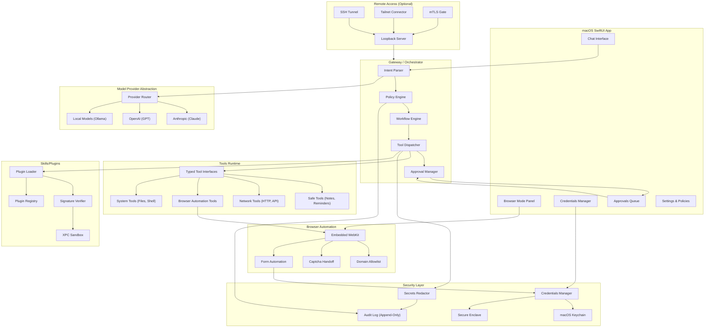

# NextStepAI - Technical Implementation Plan

> **Status:** Planning Phase (No Implementation Started)
> **Version:** 1.0.0-draft
> **Last Updated:** 2026-02-01
> **Authors:** Principal macOS/Security Engineering Team

---

## A) Executive Summary

### What is NextStepAI?

NextStepAI is a **Swift-first, security-hardened AI agent orchestration platform** for macOS that enables users to automate complex workflows through natural language commands while maintaining strict security boundaries. It is the successor to OpenClaw, designed from the ground up with a "**security-first, intelligence-second**" philosophy.

### How It Differs from OpenClaw

| Aspect | OpenClaw | NextStepAI |
|--------|----------|------------|
| **Platform** | Cross-platform (Python/JS) | Swift-first, macOS-native (portable core) |
| **Security Model** | Capability-based | Capability + explicit approval + threat-aware |
| **Credentials** | External vault integration | Native Keychain + Secure Enclave handles |
| **Browser Automation** | External browser control | Embedded WebKit with domain allowlists |
| **Plugin System** | Dynamic loading | Signed + sandboxed XPC services |
| **Audit** | Basic logging | Tamper-evident, cryptographically signed logs |
| **Remote Access** | Open endpoints | Loopback-only default; SSH/Tailnet for remote |

### Secure-by-Default Posture

NextStepAI operates under a **default-deny** security model:

1. **No tool executes without explicit capability grant**
2. **No credential is accessible without user approval for each use context**
3. **No network request leaves the device without policy evaluation**
4. **No plugin loads without valid code signature and sandbox profile**
5. **All actions are logged with tamper-evident audit trail**

---

## B) Architecture Overview

### System Diagram (Mermaid)



### ASCII Architecture Diagram

```
┌─────────────────────────────────────────────────────────────────────────────────┐
│                           NextStepAI macOS Application                          │
├─────────────────────────────────────────────────────────────────────────────────┤
│  ┌─────────────┐  ┌──────────────────────────┐  ┌─────────────────────────────┐ │
│  │  Left Nav   │  │    Center Panel          │  │     Right Panel             │ │
│  │             │  │                          │  │                             │ │
│  │  • Chat     │  │  ┌────────────────────┐  │  │  ┌───────────────────────┐  │ │
│  │  • Browser  │  │  │   Embedded WebKit  │  │  │  │  Credentials Manager  │  │ │
│  │  • History  │  │  │   (Browser Mode)   │  │  │  │  • Saved Logins       │  │ │
│  │  • Skills   │  │  │                    │  │  │  │  • API Keys           │  │ │
│  │  • Settings │  │  │   OR               │  │  │  │  • Certificates       │  │ │
│  │             │  │  │                    │  │  │  └───────────────────────┘  │ │
│  │             │  │  │   Chat Interface   │  │  │                             │ │
│  │             │  │  │   (Chat Mode)      │  │  │  ┌───────────────────────┐  │ │
│  │             │  │  │                    │  │  │  │   Approvals Queue     │  │ │
│  │             │  │  └────────────────────┘  │  │  │   • Pending Actions   │  │ │
│  │             │  │                          │  │  │   • History           │  │ │
│  └─────────────┘  └──────────────────────────┘  │  └───────────────────────┘  │ │
│                                                  └─────────────────────────────┘ │
├─────────────────────────────────────────────────────────────────────────────────┤
│                              Gateway / Orchestrator                              │
│  ┌─────────────┐  ┌─────────────┐  ┌─────────────┐  ┌─────────────────────────┐ │
│  │   Intent    │  │   Policy    │  │  Workflow   │  │   Approval Manager      │ │
│  │   Parser    │──│   Engine    │──│   Engine    │──│   (Blocks on Risky)     │ │
│  └─────────────┘  └─────────────┘  └─────────────┘  └─────────────────────────┘ │
├─────────────────────────────────────────────────────────────────────────────────┤
│                              Tools Runtime (Typed)                               │
│  ┌───────────┐  ┌───────────┐  ┌───────────┐  ┌───────────┐  ┌───────────────┐ │
│  │   Safe    │  │  Network  │  │  Browser  │  │  System   │  │   Plugin      │ │
│  │   Tools   │  │   Tools   │  │   Tools   │  │   Tools   │  │   Bridge      │ │
│  └───────────┘  └───────────┘  └───────────┘  └───────────┘  └───────────────┘ │
├─────────────────────────────────────────────────────────────────────────────────┤
│                              Security Layer                                      │
│  ┌─────────────────┐  ┌─────────────────┐  ┌───────────────────────────────────┐│
│  │   Credentials   │  │   Secrets       │  │       Audit Log                   ││
│  │   Manager       │  │   Redactor      │  │   (Append-Only, Signed)           ││
│  │   (Keychain +   │  │                 │  │                                   ││
│  │   Secure Encl.) │  │                 │  │                                   ││
│  └─────────────────┘  └─────────────────┘  └───────────────────────────────────┘│
├─────────────────────────────────────────────────────────────────────────────────┤
│                          Model Provider Abstraction                              │
│  ┌─────────────┐  ┌─────────────┐  ┌─────────────┐  ┌─────────────────────────┐ │
│  │  Anthropic  │  │   OpenAI    │  │   Local     │  │   Provider Router       │ │
│  │   (Claude)  │  │   (GPT-4)   │  │  (Ollama)   │  │   + Fallback Chain      │ │
│  └─────────────┘  └─────────────┘  └─────────────┘  └─────────────────────────┘ │
└─────────────────────────────────────────────────────────────────────────────────┘
                                        │
                    ┌───────────────────┴───────────────────┐
                    │         Remote Access (Optional)       │
                    │  ┌─────────────────────────────────┐  │
                    │  │  Loopback-only by default       │  │
                    │  │  SSH Tunnel / Tailnet for remote│  │
                    │  │  mTLS for authenticated clients │  │
                    │  └─────────────────────────────────┘  │
                    └───────────────────────────────────────┘
```

---

## C) Threat Model & Security Controls

### Threat Categories

| ID | Threat | Severity | Attack Vector | Impact |
|----|--------|----------|---------------|--------|
| T1 | **Prompt Injection** | Critical | Malicious content in web pages, emails, documents | Agent executes unintended commands |
| T2 | **Credential Exfiltration** | Critical | Model sending secrets to external endpoints | Account compromise, data breach |
| T3 | **Malicious Skills/Plugins** | High | Unsigned or tampered plugin code | Arbitrary code execution |
| T4 | **Exposed Endpoints** | High | Remote access without authentication | Unauthorized agent control |
| T5 | **Compromised Device** | High | Physical access or malware on host | Full system compromise |
| T6 | **Supply Chain Attacks** | High | Compromised dependencies or updates | Backdoor installation |
| T7 | **Log Leakage** | Medium | Secrets appearing in logs/audit trail | Information disclosure |
| T8 | **Model Provider Leakage** | Medium | Sensitive data sent to cloud LLM | Privacy violation |
| T9 | **Browser Session Hijacking** | Medium | XSS or malicious scripts in WebKit | Cookie/session theft |
| T10 | **Denial of Service** | Low | Resource exhaustion via tool loops | System unavailability |

### Security Controls Matrix

| Threat | Primary Control | Secondary Control | Monitoring |
|--------|-----------------|-------------------|------------|
| T1 Prompt Injection | Input sanitization + structured tool calling | Intent confirmation for destructive actions | Anomaly detection in tool patterns |
| T2 Credential Exfiltration | Secret handles (never raw values to model) | Allowlist for credential destinations | Audit log alerts on credential access |
| T3 Malicious Plugins | Code signing (Developer ID + notarization) | XPC sandbox with minimal entitlements | Plugin behavior monitoring |
| T4 Exposed Endpoints | Loopback-only default binding | mTLS + SSH tunnel for remote | Connection attempt logging |
| T5 Compromised Device | Secure Enclave for key storage | Biometric unlock for sensitive ops | Device attestation checks |
| T6 Supply Chain | Dependency pinning + hash verification | Reproducible builds | SBOM + vulnerability scanning |
| T7 Log Leakage | Automatic secrets redaction | Log encryption at rest | Redaction effectiveness audit |
| T8 Model Provider Leakage | Local-only mode option | Data minimization before sending | Content classification |
| T9 Browser Hijacking | Content Security Policy enforcement | Domain allowlist | Script execution monitoring |
| T10 DoS | Rate limiting + tool execution budgets | Circuit breakers | Resource usage alerts |

### Security Levels / Modes

```
┌─────────────────────────────────────────────────────────────────────────────────┐
│                           Security Level Hierarchy                               │
├─────────────────────────────────────────────────────────────────────────────────┤
│                                                                                  │
│  LOCKDOWN MODE (Emergency)                                                       │
│  ├── All remote access disabled                                                  │
│  ├── All plugins disabled                                                        │
│  ├── Browser automation disabled                                                 │
│  ├── Only local chat with read-only tools                                       │
│  └── Triggered by: security incident, user panic, anomaly detection             │
│                                                                                  │
│  READ-ONLY MODE                                                                  │
│  ├── Tools: Read files, search, browse (no form fills)                          │
│  ├── No credential access                                                       │
│  ├── No system modifications                                                    │
│  ├── No network writes (GET only)                                               │
│  └── Use case: Research, browsing, information gathering                        │
│                                                                                  │
│  STANDARD MODE (Default)                                                         │
│  ├── Tools: All safe tools enabled                                              │
│  ├── Credentials: User approval per-session per-domain                          │
│  ├── Browser: Allowlisted domains only                                          │
│  ├── Network: Allowlisted APIs only                                             │
│  ├── System: User-scoped file access only                                       │
│  └── Use case: Normal daily workflows                                           │
│                                                                                  │
│  ELEVATED MODE (Privileged)                                                      │
│  ├── Tools: System tools, shell access (sandboxed)                              │
│  ├── Credentials: Can access without per-use approval (session scoped)          │
│  ├── Browser: Extended domain list                                              │
│  ├── Requires: Biometric confirmation to enter                                  │
│  ├── Auto-expires: After 15 minutes of inactivity                               │
│  └── Use case: Administrative tasks, debugging                                  │
│                                                                                  │
└─────────────────────────────────────────────────────────────────────────────────┘
```

### Tool Permissions by Security Level

| Tool Category | Lockdown | Read-Only | Standard | Elevated |
|---------------|----------|-----------|----------|----------|
| Read local files | User dir only | User dir | User dir | Full (sandboxed) |
| Write local files | No | No | User dir (approval) | User dir |
| Shell execution | No | No | No | Sandboxed (approval) |
| HTTP GET | No | Allowlist | Allowlist | Extended |
| HTTP POST/PUT/DELETE | No | No | Allowlist (approval) | Approval |
| Browser navigation | No | Allowlist | Allowlist | Extended |
| Form filling | No | No | Approval + allowlist | Approval |
| Credential access | No | No | Per-use approval | Session approval |
| Plugin execution | No | No | Signed only | Signed only |

---

## D) Milestones (Incremental Shipping)

### Milestone 1: Skeleton macOS SwiftUI App + Local Chat UI

**Scope:**
- Basic SwiftUI app structure with navigation
- Three-panel layout (left nav, center content, right sidebar)
- Local chat interface (no model integration yet)
- Settings screen with placeholder preferences
- App lifecycle management

**Exit Criteria / Acceptance Tests:**
- [ ] App launches without crashes on macOS 14+
- [ ] Navigation between Chat, Browser (placeholder), History, Settings works
- [ ] Chat messages display in scrollable list
- [ ] User can type and submit messages (echoed back locally)
- [ ] Settings persist across app restarts (UserDefaults)
- [ ] App correctly handles backgrounding/foregrounding

**Security Checklist:**
- [ ] App Sandbox enabled with minimal entitlements
- [ ] No network permissions yet
- [ ] No file access beyond container
- [ ] Code signing with Developer ID

**Risk Notes:**
- SwiftUI navigation APIs changed in macOS 14; ensure compatibility
- Three-panel layout must work on various window sizes

**Complexity:** Small (S)

---

### Milestone 2: Policy Engine + Capability Model + Approvals UI

**Scope:**
- Define capability types and permission model
- Implement policy evaluation engine
- Build approvals queue UI in right sidebar
- Connect approvals to mock tool execution
- Persist granted capabilities

**Exit Criteria / Acceptance Tests:**
- [ ] Capability grants can be created, evaluated, and revoked
- [ ] Policy engine correctly allows/denies based on capability state
- [ ] Approvals queue shows pending requests with context
- [ ] User can approve/deny individual requests
- [ ] User can approve with "remember for session" option
- [ ] Denied requests are logged with reason
- [ ] Capabilities survive app restart (encrypted storage)

**Security Checklist:**
- [ ] Capability grants are signed with device key
- [ ] No capability escalation without user action
- [ ] Audit log entry for every capability change
- [ ] Policy evaluation is synchronous (no TOCTOU)

**Risk Notes:**
- Capability model must be extensible for future tool types
- UI must clearly communicate what is being approved

**Complexity:** Medium (M)

---

### Milestone 3: Credentials Manager (Keychain) + Secret Handles + Redaction

**Scope:**
- Keychain integration for credential storage
- Secure Enclave key generation for encryption
- Secret handle abstraction (opaque references, never raw values)
- Automatic redaction in logs and model context
- Credentials manager UI in right sidebar

**Exit Criteria / Acceptance Tests:**
- [ ] Credentials stored in Keychain with access control (biometric)
- [ ] Secret handles are opaque UUIDs, not decryptable by model
- [ ] Credential retrieval requires explicit user approval
- [ ] Secrets automatically redacted from audit logs
- [ ] Secrets automatically redacted before sending to model provider
- [ ] Credentials manager UI shows stored items (metadata only)
- [ ] User can add/edit/delete credentials
- [ ] Export/import with encryption supported

**Security Checklist:**
- [ ] No raw secrets in memory longer than necessary
- [ ] Secrets stored with `.whenUnlockedThisDeviceOnly` access
- [ ] Secure Enclave used for encryption key (not exportable)
- [ ] Failed auth attempts rate-limited
- [ ] Credential access logged with destination context

**Risk Notes:**
- Keychain API complexity; test edge cases (locked keychain, etc.)
- Redaction must handle various secret formats (API keys, passwords, tokens)

**Complexity:** Medium (M)

---

### Milestone 4: Tool System Scaffolding + Safe Tools

**Scope:**
- Define typed tool protocol and invocation interface
- Implement tool registry and dispatcher
- Build 5 safe tools: Notes, Reminders, Calculator, LocalSearch, Clipboard
- Connect tools to policy engine for gating
- Tool execution UI feedback

**Exit Criteria / Acceptance Tests:**
- [ ] Tool protocol defined with input/output types
- [ ] Tool registry can discover and list available tools
- [ ] Tool dispatcher routes requests through policy engine
- [ ] Notes tool: create, read, update, delete notes
- [ ] Reminders tool: create reminders with due dates
- [ ] Calculator tool: evaluate mathematical expressions
- [ ] LocalSearch tool: search files in user directory
- [ ] Clipboard tool: read/write clipboard (with approval)
- [ ] Tool execution shows status in UI
- [ ] Failed tool calls show error with recovery hints

**Security Checklist:**
- [ ] Every tool call goes through policy engine
- [ ] Tool inputs sanitized before execution
- [ ] Tool outputs do not leak secrets
- [ ] File access restricted to user directory
- [ ] Clipboard access requires explicit approval

**Risk Notes:**
- Tool type system must be expressive but not overly complex
- LocalSearch must handle large directories efficiently

**Complexity:** Medium (M)

---

### Milestone 5: Browser Mode UI + Domain Allowlist + Automation Scaffolding

**Scope:**
- Embedded WebKit view in center panel
- Domain allowlist with default safe list
- Basic navigation controls (URL bar, back/forward, refresh)
- Page content extraction for model context
- Browser automation protocol scaffolding

**Exit Criteria / Acceptance Tests:**
- [ ] WebKit view renders web pages correctly
- [ ] Navigation to allowlisted domains works
- [ ] Navigation to non-allowlisted domains blocked with explanation
- [ ] User can add domains to allowlist (persisted)
- [ ] Page title and URL shown in UI
- [ ] Page text content extractable for model context
- [ ] JavaScript execution sandboxed (no access to host)
- [ ] Cookies isolated to NextStepAI container

**Security Checklist:**
- [ ] WebKit process is sandboxed
- [ ] No JavaScript bridge to host application
- [ ] Content Security Policy enforced
- [ ] Mixed content blocked
- [ ] Certificate validation enabled (no bypass)
- [ ] Default allowlist is minimal (major sites only)

**Risk Notes:**
- WebKit integration on macOS is well-documented but requires careful configuration
- Cookie isolation is critical for security

**Complexity:** Medium (M)

---

### Milestone 6: Login Workflow (Credential Fill + Captcha Handoff)

**Scope:**
- Form detection in web pages
- Credential fill flow with user approval
- Captcha detection and handoff to user
- Login success/failure detection
- Session persistence

**Exit Criteria / Acceptance Tests:**
- [ ] Login forms detected on common sites (Google, GitHub, etc.)
- [ ] Credential fill shows approval dialog with site and credential name
- [ ] User can select which credential to use
- [ ] Captchas detected and user prompted to solve manually
- [ ] Agent waits during captcha handoff
- [ ] Login success detected (redirect or element change)
- [ ] Login failure shows error and allows retry
- [ ] Session cookies persisted for allowlisted domains

**Security Checklist:**
- [ ] Credentials only filled on allowlisted domains
- [ ] Domain verified against credential's associated domain
- [ ] Phishing detection (domain similarity check)
- [ ] Captcha never bypassed or automated
- [ ] Failed login attempts rate-limited
- [ ] Credential fill requires fresh approval (not cached)

**Risk Notes:**
- Form detection heuristics may fail on unusual forms
- Captcha detection is heuristic-based
- Must handle 2FA flows gracefully

**Complexity:** Large (L)

---

### Milestone 7: Remote Access Model (Loopback + SSH/Tailnet)

**Scope:**
- Local HTTP server bound to 127.0.0.1 only
- SSH tunnel documentation and helper scripts
- Tailscale/Tailnet integration for authenticated remote
- mTLS option for direct remote (enterprise)
- Remote session management UI

**Exit Criteria / Acceptance Tests:**
- [ ] Local server only accessible from localhost by default
- [ ] External connection attempts rejected with log entry
- [ ] SSH tunnel setup documented with example commands
- [ ] Tailnet connection works when Tailscale installed
- [ ] mTLS mode requires client certificate
- [ ] Remote sessions visible in UI with source info
- [ ] User can terminate remote sessions
- [ ] Rate limiting on authentication attempts

**Security Checklist:**
- [ ] Default bind is 127.0.0.1 (cannot be changed without elevated mode)
- [ ] No UPnP or automatic port forwarding
- [ ] All remote modes require authentication
- [ ] Session tokens are short-lived and rotatable
- [ ] Remote access attempts logged with source IP
- [ ] Failed auth triggers progressive delays

**Risk Notes:**
- SSH tunnel complexity may confuse users; good docs essential
- Tailnet requires Tailscale daemon; graceful fallback needed

**Complexity:** Medium (M)

---

### Milestone 8: Skills/Plugin Packaging with Signing + Sandboxing

**Scope:**
- Plugin bundle format specification
- Code signing verification (Developer ID + notarization)
- XPC service sandboxing for plugin execution
- Plugin manifest with declared capabilities
- Plugin registry and discovery

**Exit Criteria / Acceptance Tests:**
- [ ] Plugin bundle format documented
- [ ] Plugins must be code signed to load
- [ ] Notarization check for plugins from internet
- [ ] XPC service isolates plugin from main process
- [ ] Plugin can only access declared capabilities
- [ ] Plugin manifest specifies required tools/permissions
- [ ] User approves plugin capabilities on first load
- [ ] Unsigned plugins rejected with clear error
- [ ] Plugin updates require re-verification

**Security Checklist:**
- [ ] Signature verification before any plugin code runs
- [ ] XPC sandbox profile denies network/file by default
- [ ] Plugin capabilities are subset of user's granted capabilities
- [ ] Plugin crashes don't crash main app
- [ ] Plugin memory/CPU usage is limited
- [ ] Audit log tracks plugin loads and capability grants

**Risk Notes:**
- XPC services add complexity; thorough testing needed
- Plugin developers need clear documentation and signing process

**Complexity:** Large (L)

---

### Milestone 9: Audit Log + Incident Response (Lockdown Mode)

**Scope:**
- Append-only audit log with cryptographic chaining
- Log viewer UI with filtering
- Log export for forensics
- Lockdown mode trigger and behavior
- Security incident detection (anomaly heuristics)

**Exit Criteria / Acceptance Tests:**
- [ ] All security-relevant events logged
- [ ] Log entries are hash-chained (tamper-evident)
- [ ] Log viewer shows events with timestamps and categories
- [ ] Logs filterable by event type, time, severity
- [ ] Logs exportable as signed JSON
- [ ] Lockdown mode activatable from UI
- [ ] Lockdown mode activatable automatically on anomaly
- [ ] Lockdown mode disables: remote, plugins, browser automation, credential access
- [ ] Recovery from lockdown requires authentication
- [ ] Anomaly detection: unusual tool patterns, rapid credential access

**Security Checklist:**
- [ ] Logs encrypted at rest
- [ ] Log file cannot be modified without detection
- [ ] Log rotation preserves chain integrity
- [ ] Lockdown cannot be bypassed without user auth
- [ ] Incident context captured on lockdown trigger

**Risk Notes:**
- Log volume may grow quickly; rotation strategy needed
- Anomaly detection may produce false positives initially

**Complexity:** Medium (M)

---

### Milestone 10: Hardening + Security Review + Threat Model Regression

**Scope:**
- Comprehensive security audit
- Penetration testing (prompt injection, escape attempts)
- Threat model validation against implementation
- Performance optimization
- Documentation finalization

**Exit Criteria / Acceptance Tests:**
- [ ] All threat model controls verified implemented
- [ ] Prompt injection test suite passes
- [ ] Credential exfiltration attempts blocked
- [ ] Plugin escape attempts contained
- [ ] Remote access security verified
- [ ] Log integrity verified
- [ ] Performance targets met (see Non-Functional Requirements)
- [ ] Security documentation complete
- [ ] User documentation complete
- [ ] Release notes drafted

**Security Checklist:**
- [ ] Third-party security review completed
- [ ] All critical/high issues resolved
- [ ] Medium issues have mitigation plan
- [ ] Security advisory process defined
- [ ] Vulnerability disclosure policy published

**Risk Notes:**
- External security review may reveal unexpected issues
- Hardening may impact performance; balance needed

**Complexity:** Large (L)

---

## E) Repo Structure & Modules (Swift Package Layout)

```
NextStepAI/
├── README.md
├── SPEC.md                           # Product specification
├── TECHNICAL-IMPLEMENTATION-PLAN.md  # This document
├── SECURITY.md                       # Security policy and advisories
├── CHANGELOG.md                      # Release notes
│
├── Package.swift                     # Root package manifest
│
├── Sources/
│   ├── NextStepAIApp/               # SwiftUI macOS Application
│   │   ├── App/
│   │   │   ├── NextStepAIApp.swift      # @main entry point
│   │   │   ├── AppDelegate.swift         # App lifecycle
│   │   │   └── AppState.swift            # Global app state
│   │   ├── Views/
│   │   │   ├── MainWindow/
│   │   │   │   ├── MainWindowView.swift
│   │   │   │   ├── LeftNavigationView.swift
│   │   │   │   ├── CenterContentView.swift
│   │   │   │   └── RightSidebarView.swift
│   │   │   ├── Chat/
│   │   │   │   ├── ChatView.swift
│   │   │   │   ├── MessageBubbleView.swift
│   │   │   │   └── ChatInputView.swift
│   │   │   ├── Browser/
│   │   │   │   ├── BrowserModeView.swift
│   │   │   │   ├── WebViewContainer.swift
│   │   │   │   └── NavigationBarView.swift
│   │   │   ├── Credentials/
│   │   │   │   ├── CredentialsManagerView.swift
│   │   │   │   ├── CredentialRowView.swift
│   │   │   │   └── AddCredentialSheet.swift
│   │   │   ├── Approvals/
│   │   │   │   ├── ApprovalsQueueView.swift
│   │   │   │   ├── ApprovalRequestView.swift
│   │   │   │   └── ApprovalHistoryView.swift
│   │   │   ├── Settings/
│   │   │   │   ├── SettingsView.swift
│   │   │   │   ├── SecuritySettingsView.swift
│   │   │   │   ├── ProviderSettingsView.swift
│   │   │   │   └── PluginSettingsView.swift
│   │   │   └── Shared/
│   │   │       ├── LoadingView.swift
│   │   │       └── ErrorView.swift
│   │   ├── ViewModels/
│   │   │   ├── ChatViewModel.swift
│   │   │   ├── BrowserViewModel.swift
│   │   │   ├── CredentialsViewModel.swift
│   │   │   └── ApprovalsViewModel.swift
│   │   └── Resources/
│   │       ├── Assets.xcassets
│   │       └── Localizable.strings
│   │
│   ├── NextStepAICore/              # Agent Orchestration (Portable)
│   │   ├── Gateway/
│   │   │   ├── Gateway.swift            # Main orchestrator
│   │   │   ├── GatewayConfiguration.swift
│   │   │   └── GatewayState.swift
│   │   ├── Intent/
│   │   │   ├── Intent.swift             # Intent data model
│   │   │   ├── IntentParser.swift       # NL to intent
│   │   │   └── IntentResolver.swift     # Intent to workflow
│   │   ├── Workflow/
│   │   │   ├── Workflow.swift           # Workflow model
│   │   │   ├── WorkflowEngine.swift     # Execution engine
│   │   │   ├── WorkflowStep.swift
│   │   │   └── WorkflowState.swift
│   │   ├── Session/
│   │   │   ├── Session.swift
│   │   │   ├── SessionManager.swift
│   │   │   └── SessionPersistence.swift
│   │   └── Errors/
│   │       └── CoreErrors.swift
│   │
│   ├── NextStepAIPolicy/            # Capabilities & Policy Engine
│   │   ├── Capability/
│   │   │   ├── Capability.swift         # Capability types
│   │   │   ├── CapabilityGrant.swift    # Granted permissions
│   │   │   └── CapabilityScope.swift    # Scope definitions
│   │   ├── Policy/
│   │   │   ├── PolicyEngine.swift       # Evaluation engine
│   │   │   ├── PolicyRule.swift         # Rule definitions
│   │   │   └── PolicyEvaluator.swift    # Rule evaluation
│   │   ├── Approval/
│   │   │   ├── ApprovalRequest.swift    # Request model
│   │   │   ├── ApprovalManager.swift    # Request handling
│   │   │   └── ApprovalDecision.swift   # Decision model
│   │   └── SecurityLevel/
│   │       ├── SecurityLevel.swift      # Level definitions
│   │       └── LevelTransition.swift    # Level changes
│   │
│   ├── NextStepAITools/             # Tool System
│   │   ├── Protocol/
│   │   │   ├── Tool.swift               # Tool protocol
│   │   │   ├── ToolInput.swift          # Input types
│   │   │   ├── ToolOutput.swift         # Output types
│   │   │   └── ToolMetadata.swift       # Tool description
│   │   ├── Registry/
│   │   │   ├── ToolRegistry.swift       # Tool registration
│   │   │   └── ToolDiscovery.swift      # Auto-discovery
│   │   ├── Dispatcher/
│   │   │   ├── ToolDispatcher.swift     # Dispatch logic
│   │   │   └── ToolExecutor.swift       # Execution wrapper
│   │   ├── BuiltIn/
│   │   │   ├── NotesTool.swift
│   │   │   ├── RemindersTool.swift
│   │   │   ├── CalculatorTool.swift
│   │   │   ├── LocalSearchTool.swift
│   │   │   ├── ClipboardTool.swift
│   │   │   ├── HTTPTool.swift
│   │   │   └── ShellTool.swift
│   │   └── Validation/
│   │       ├── InputValidator.swift
│   │       └── OutputSanitizer.swift
│   │
│   ├── NextStepAISecrets/           # Credentials & Encryption
│   │   ├── Keychain/
│   │   │   ├── KeychainManager.swift    # Keychain wrapper
│   │   │   ├── KeychainItem.swift       # Item model
│   │   │   └── KeychainAccess.swift     # Access control
│   │   ├── SecureEnclave/
│   │   │   ├── EnclaveKeyManager.swift  # Key generation
│   │   │   └── EnclaveOperations.swift  # Crypto operations
│   │   ├── Handles/
│   │   │   ├── SecretHandle.swift       # Opaque handle
│   │   │   ├── HandleRegistry.swift     # Handle management
│   │   │   └── HandleResolver.swift     # Handle to value
│   │   ├── Redaction/
│   │   │   ├── SecretsRedactor.swift    # Redaction logic
│   │   │   └── RedactionPatterns.swift  # Pattern matching
│   │   └── Credential/
│   │       ├── Credential.swift         # Credential model
│   │       ├── CredentialStore.swift    # Storage interface
│   │       └── CredentialMetadata.swift # Non-secret metadata
│   │
│   ├── NextStepAIBrowser/           # Browser Embedding & Automation
│   │   ├── WebView/
│   │   │   ├── WebViewManager.swift     # WebKit management
│   │   │   ├── WebViewConfiguration.swift
│   │   │   └── WebViewDelegate.swift    # Navigation delegate
│   │   ├── Allowlist/
│   │   │   ├── DomainAllowlist.swift    # Domain list
│   │   │   ├── AllowlistManager.swift   # CRUD operations
│   │   │   └── DomainMatcher.swift      # Matching logic
│   │   ├── Automation/
│   │   │   ├── PageAnalyzer.swift       # DOM analysis
│   │   │   ├── FormDetector.swift       # Form detection
│   │   │   ├── FormFiller.swift         # Credential fill
│   │   │   └── CaptchaDetector.swift    # Captcha detection
│   │   ├── Content/
│   │   │   ├── ContentExtractor.swift   # Page text extraction
│   │   │   └── ContentSanitizer.swift   # XSS prevention
│   │   └── Session/
│   │       ├── CookieManager.swift      # Cookie isolation
│   │       └── SessionStore.swift       # Session persistence
│   │
│   ├── NextStepAIAudit/             # Audit Logging
│   │   ├── Log/
│   │   │   ├── AuditLog.swift           # Log interface
│   │   │   ├── AuditEvent.swift         # Event model
│   │   │   └── AuditWriter.swift        # Append-only writer
│   │   ├── Chain/
│   │   │   ├── HashChain.swift          # Tamper-evident chain
│   │   │   └── ChainVerifier.swift      # Integrity check
│   │   ├── Export/
│   │   │   ├── LogExporter.swift        # Export to file
│   │   │   └── LogSigner.swift          # Sign exports
│   │   └── Incident/
│   │       ├── IncidentDetector.swift   # Anomaly detection
│   │       ├── LockdownManager.swift    # Lockdown trigger
│   │       └── IncidentReport.swift     # Report model
│   │
│   ├── NextStepAIProviders/         # Model Provider Abstraction
│   │   ├── Protocol/
│   │   │   ├── ModelProvider.swift      # Provider protocol
│   │   │   ├── ModelRequest.swift       # Request model
│   │   │   └── ModelResponse.swift      # Response model
│   │   ├── Providers/
│   │   │   ├── AnthropicProvider.swift  # Claude integration
│   │   │   ├── OpenAIProvider.swift     # GPT integration
│   │   │   └── OllamaProvider.swift     # Local models
│   │   ├── Router/
│   │   │   ├── ProviderRouter.swift     # Provider selection
│   │   │   └── FallbackChain.swift      # Fallback logic
│   │   └── Privacy/
│   │       ├── ContentClassifier.swift  # Sensitive data detection
│   │       └── DataMinimizer.swift      # Strip sensitive data
│   │
│   ├── NextStepAIPlugins/           # Plugin System
│   │   ├── Bundle/
│   │   │   ├── PluginBundle.swift       # Bundle format
│   │   │   ├── PluginManifest.swift     # Manifest parsing
│   │   │   └── PluginLoader.swift       # Load plugin
│   │   ├── Verification/
│   │   │   ├── SignatureVerifier.swift  # Code signing check
│   │   │   └── NotarizationChecker.swift # Apple notarization
│   │   ├── Sandbox/
│   │   │   ├── XPCService.swift         # XPC wrapper
│   │   │   └── SandboxProfile.swift     # Sandbox rules
│   │   └── Registry/
│   │       ├── PluginRegistry.swift     # Installed plugins
│   │       └── PluginDiscovery.swift    # Discovery
│   │
│   └── NextStepAIRemote/            # Remote Access
│       ├── Server/
│       │   ├── LoopbackServer.swift     # Local HTTP server
│       │   ├── ServerConfiguration.swift
│       │   └── RequestHandler.swift     # Request routing
│       ├── Authentication/
│       │   ├── SessionToken.swift       # Token management
│       │   ├── mTLSAuthenticator.swift  # Certificate auth
│       │   └── AuthMiddleware.swift     # Auth middleware
│       ├── Tunnel/
│       │   ├── SSHTunnelHelper.swift    # SSH setup help
│       │   └── TailnetConnector.swift   # Tailscale integration
│       └── Session/
│           ├── RemoteSession.swift      # Session model
│           └── SessionManager.swift     # Session lifecycle
│
├── Tests/
│   ├── NextStepAICoreTests/
│   │   ├── GatewayTests.swift
│   │   ├── IntentParserTests.swift
│   │   └── WorkflowEngineTests.swift
│   ├── NextStepAIPolicyTests/
│   │   ├── PolicyEngineTests.swift
│   │   ├── CapabilityTests.swift
│   │   └── ApprovalManagerTests.swift
│   ├── NextStepAIToolsTests/
│   │   ├── ToolDispatcherTests.swift
│   │   └── BuiltInToolsTests.swift
│   ├── NextStepAISecretsTests/
│   │   ├── KeychainManagerTests.swift
│   │   ├── SecretHandleTests.swift
│   │   └── RedactionTests.swift
│   ├── NextStepAIBrowserTests/
│   │   ├── DomainAllowlistTests.swift
│   │   └── FormDetectorTests.swift
│   ├── NextStepAIAuditTests/
│   │   ├── HashChainTests.swift
│   │   └── AuditLogTests.swift
│   ├── NextStepAISecurityTests/     # Security-specific tests
│   │   ├── PromptInjectionTests.swift
│   │   ├── CredentialExfiltrationTests.swift
│   │   ├── PluginEscapeTests.swift
│   │   └── LogLeakageTests.swift
│   └── NextStepAIIntegrationTests/
│       ├── LoginWorkflowTests.swift
│       └── EndToEndTests.swift
│
├── Plugins/                         # Example plugins for testing
│   └── ExamplePlugin/
│       ├── manifest.json
│       └── Sources/
│
└── Scripts/
    ├── setup-dev.sh                 # Development setup
    ├── sign-plugin.sh               # Plugin signing helper
    └── run-security-tests.sh        # Security test suite
```

---

## F) Key Technical Decisions

### Decision 1: Browser Engine - Embedded WebKit vs Chromium

| Option | Pros | Cons |
|--------|------|------|
| **WebKit (WKWebView)** | Native macOS integration, smaller footprint, Apple-maintained security | Some web compatibility issues, less automation tooling |
| **Chromium (CEF)** | Best web compatibility, rich DevTools Protocol | Large binary (~200MB), complex build, potential security lag |
| **Electron WebView** | JavaScript-familiar automation | Massive footprint, not Swift-native |

**Decision:** **WebKit (WKWebView)**

**Rationale:**
- Native macOS integration with system security (App Transport Security, sandboxing)
- Significantly smaller binary size (~0 additional MB vs ~200MB for Chromium)
- Apple's security patches apply automatically via macOS updates
- Sufficient automation capability via `evaluateJavaScript` and `WKScriptMessageHandler`
- Browser Mode is not a full browser replacement; compatibility with major sites is sufficient

---

### Decision 2: Local Gateway - Embedded vs Separate Daemon

| Option | Pros | Cons |
|--------|------|------|
| **Embedded (in-process)** | Simpler deployment, single binary, easier debugging | Crash affects UI, less isolation |
| **Separate daemon (launchd)** | Process isolation, can run headless, survives UI crash | Complex IPC, deployment complexity |
| **XPC Service** | Apple-sanctioned isolation, crash isolation | Still tied to app lifecycle somewhat |

**Decision:** **Embedded (in-process) with optional XPC for heavy operations**

**Rationale:**
- Simplicity for v1; single app bundle is easier to distribute and update
- For security-sensitive operations (credential access, plugin execution), use XPC services
- Future milestone can extract to daemon if headless operation becomes a requirement
- Remote access server can be embedded with async handling

---

### Decision 3: Local State Storage - SQLite vs File-based vs CoreData

| Option | Pros | Cons |
|--------|------|------|
| **SQLite (direct)** | Fast, portable, encryption via SQLCipher | More code for ORM-like features |
| **CoreData** | Apple-native, CloudKit sync option | Complex, overkill for our schema |
| **File-based (JSON/Plist)** | Simple, human-readable | Poor query performance, no transactions |
| **GRDB.swift (SQLite wrapper)** | Swift-native, type-safe, encryption | Dependency, but well-maintained |

**Decision:** **GRDB.swift with SQLCipher encryption**

**Rationale:**
- Type-safe Swift interface reduces bugs
- SQLCipher provides encryption at rest without additional complexity
- Excellent performance for our data model (sessions, workflows, audit logs)
- Portable core can use SQLite on other platforms
- Better than CoreData for our use case (no CloudKit needed, simpler schema)

---

### Decision 4: Crypto Primitives and Key Storage

| Aspect | Decision |
|--------|----------|
| **Encryption algorithm** | AES-256-GCM (authenticated encryption) |
| **Key derivation** | PBKDF2 with 600,000 iterations (OWASP 2023 recommendation) |
| **Master key storage** | Secure Enclave (non-exportable, biometric-gated) |
| **Per-credential encryption** | Derived key per credential, stored in Keychain |
| **Audit log signing** | ECDSA P-256 (Secure Enclave) |

**Rationale:**
- Secure Enclave provides hardware-backed key protection on Apple Silicon
- Biometric gating adds user verification without passwords
- AES-256-GCM is standard and well-audited
- ECDSA P-256 is efficient for signing and Secure Enclave-compatible

---

### Decision 5: Plugin Sandboxing on macOS

| Option | Pros | Cons |
|--------|------|------|
| **XPC Service per plugin** | Full process isolation, Apple-supported | Higher overhead per plugin |
| **App Sandbox with entitlements** | Lightweight | Same process, less isolation |
| **Container (Docker-like)** | Strong isolation | Not native, complex on macOS |
| **WASM runtime** | Language-agnostic, sandboxed | Performance overhead, limited APIs |

**Decision:** **XPC Service per plugin**

**Rationale:**
- XPC is the Apple-sanctioned way to isolate untrusted code
- Each plugin runs in its own process with custom sandbox profile
- Crashes in plugins don't affect main app
- Can enforce strict resource limits (memory, CPU, network)
- Code signing verification before XPC service launch

---

### Decision 6: Tool Permissions and Approvals in Swift

**Design Pattern:**

```swift
// Capability-based permission model
enum Capability: Hashable {
    case readFile(scope: FileScope)
    case writeFile(scope: FileScope)
    case network(domain: String, methods: Set<HTTPMethod>)
    case credential(id: CredentialID, usage: CredentialUsage)
    case browser(domain: String, actions: Set<BrowserAction>)
    case shell(sandboxProfile: SandboxProfile)
    case plugin(id: PluginID)
}

// Grant with expiration and scope
struct CapabilityGrant {
    let capability: Capability
    let grantedAt: Date
    let expiresAt: Date?
    let scope: GrantScope // .once, .session, .untilRevoked
    let signature: Data // Signed with device key
}

// Tool declaration
protocol Tool {
    static var metadata: ToolMetadata { get }
    static var requiredCapabilities: [Capability] { get }

    func execute(input: ToolInput, context: ToolContext) async throws -> ToolOutput
}

// Policy evaluation before execution
actor PolicyEngine {
    func evaluate(tool: any Tool, context: ToolContext) async -> PolicyDecision {
        // Check all required capabilities are granted
        // Check security level allows tool category
        // Check rate limits not exceeded
        // Return .allow, .deny(reason), or .requireApproval(request)
    }
}
```

**Rationale:**
- Actors for thread-safe policy evaluation
- Capabilities are explicit and enumerable
- Grants are signed to prevent tampering
- Policy engine is the single chokepoint for all tool execution

---

## G) Test Strategy

### Unit Tests

**Coverage Targets:**
- Policy engine: 95% coverage (security-critical)
- Capability evaluation: 95% coverage
- Secret redaction: 95% coverage
- Tool input validation: 90% coverage
- All other modules: 80% coverage

**Key Test Cases:**
- Policy engine correctly denies tools without capability
- Policy engine correctly allows tools with valid grant
- Expired grants are rejected
- Tampered grants are rejected (signature verification)
- Secret handles cannot be resolved by unauthorized code
- Redaction patterns catch all common secret formats

### Integration Tests

**Workflow Tests:**
- Chat message → intent parsing → tool execution → response
- Browser navigation → form detection → credential fill → success
- Plugin load → capability request → approval → execution
- Remote connection → authentication → command → result

**Cross-Module Tests:**
- Credentials manager ↔ Browser automation ↔ Policy engine
- Audit log captures all security-relevant events
- Lockdown mode disables all expected features

### Security Tests

**Prompt Injection Suite:**
```
Test: Inject malicious instruction in web page content
Expected: Tool calls not affected by page content
Method: Load page with "ignore previous instructions" text, verify no behavior change

Test: Inject tool call syntax in user message
Expected: Parsed as text, not as tool invocation
Method: Send message containing JSON tool call format

Test: Exfiltrate secrets via crafted tool parameters
Expected: Secrets redacted before any external communication
Method: Attempt to include secret in HTTP request body
```

**Credential Exfiltration Suite:**
```
Test: Request credential for non-matching domain
Expected: Credential fill blocked, logged
Method: Navigate to evil.com, request credential for bank.com

Test: Access credential without approval
Expected: Access denied, logged
Method: Bypass approval UI, directly call credential resolver

Test: Leak credential in model context
Expected: Only handle sent, not value
Method: Inspect model request payload
```

**Plugin Escape Suite:**
```
Test: Plugin attempts file system access outside sandbox
Expected: Access denied by sandbox
Method: Plugin code tries to read /etc/passwd

Test: Plugin attempts network access
Expected: Blocked unless declared in manifest and approved
Method: Plugin code tries to open socket

Test: Plugin attempts to message other plugins
Expected: Isolated, no cross-plugin communication
Method: Plugin tries to find other XPC services
```

### Audit Log Integrity Tests

```
Test: Modify log entry
Expected: Chain verification fails
Method: Edit log file, run verification

Test: Delete log entry
Expected: Chain verification fails
Method: Remove entry, run verification

Test: Log contains no secrets
Expected: All secrets redacted
Method: Grep log for known secret patterns
```

### CI Strategy

**GitHub Actions Workflow:**

```yaml
name: CI

on: [push, pull_request]

jobs:
  build:
    runs-on: macos-14
    steps:
      - uses: actions/checkout@v4
      - name: Build
        run: swift build
      - name: Unit Tests
        run: swift test --filter ".*Tests$"
      - name: Security Tests
        run: swift test --filter ".*SecurityTests$"

  security-scan:
    runs-on: macos-14
    steps:
      - uses: actions/checkout@v4
      - name: Dependency Audit
        run: swift package audit
      - name: Static Analysis
        run: swiftlint --strict
      - name: Secret Scan
        run: gitleaks detect --source .

  integration:
    runs-on: macos-14
    needs: build
    steps:
      - uses: actions/checkout@v4
      - name: Integration Tests
        run: swift test --filter ".*IntegrationTests$"
```

---

## H) "Do Not Implement Yet" Checklist

### Confirmation

- [x] **No implementation code has been written**
- [x] **This document is planning-only**
- [x] **All code examples are illustrative, not runnable**

### Open Questions (Assumptions Made)

| # | Question | Assumption Made | Impact if Wrong |
|---|----------|-----------------|-----------------|
| 1 | Target macOS version? | macOS 14+ (Sonoma) for latest security APIs | May need to support older versions |
| 2 | Should support iOS/iPadOS? | No, macOS-only for v1; portable core enables future | May need SwiftUI adjustments |
| 3 | Specific model providers required? | Anthropic (Claude) primary, OpenAI secondary, local optional | May need additional providers |
| 4 | Plugin language support? | Swift only for v1 (simplifies signing/sandboxing) | May need JavaScript/Python support |
| 5 | Enterprise features (SSO, SCIM)? | Not in v1; focus on individual/small team | Enterprise customers may need sooner |
| 6 | Offline mode required? | Yes, with local models (Ollama); graceful degradation | May need different UX if always-online |
| 7 | Multi-user on single device? | No; single-user app with per-user Keychain | May need user switching |
| 8 | Existing OpenClaw data migration? | No; clean start | May need migration tools |
| 9 | Localization? | English only for v1 | May need i18n infrastructure |
| 10 | Accessibility? | Basic VoiceOver support from SwiftUI | May need enhanced a11y |

### Dependencies to Finalize

- [ ] GRDB.swift version and SQLCipher integration approach
- [ ] Model provider SDK versions (Anthropic Swift SDK, OpenAI Swift SDK)
- [ ] Tailscale SDK or API integration approach
- [ ] Code signing certificate and notarization workflow
- [ ] CI/CD infrastructure (GitHub Actions, self-hosted runners for macOS)

### Pre-Implementation Reviews Needed

- [ ] Security architecture review with external consultant
- [ ] UX design review for approval flows
- [ ] Legal review for credential storage (financial services implications)
- [ ] Privacy review for model provider data minimization

---

## Appendix: Glossary

| Term | Definition |
|------|------------|
| **Capability** | A specific permission (e.g., read file X, access credential Y) |
| **Capability Grant** | A signed token granting a capability with scope and expiration |
| **Gateway** | The central orchestrator that parses intents and dispatches tools |
| **Intent** | A parsed user request (e.g., "log into GitHub" → Intent.login(domain: "github.com")) |
| **Lockdown Mode** | Emergency security state that disables risky features |
| **Secret Handle** | An opaque reference to a credential (UUID), not the credential itself |
| **Security Level** | The current operational mode (Read-Only, Standard, Elevated, Lockdown) |
| **Tool** | A typed function the agent can invoke (e.g., NotesTool, HTTPTool) |
| **Workflow** | A sequence of tool invocations to achieve an intent |
| **XPC Service** | An Apple IPC mechanism for isolated helper processes |

---

*End of Technical Implementation Plan*
